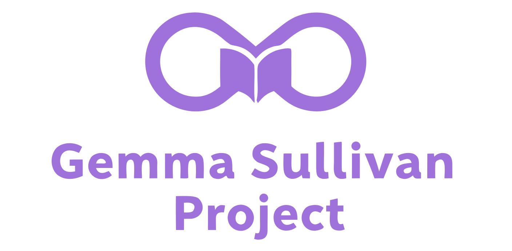

<p align="center">
  <a href="https://github.com/DavidLMS/gemma-sullivan-project/pulls">
    
  </a>
  <a href="LICENSE">
      
    </a>
</p>

# Gemma Sullivan Project

The Gemma Sullivan Project is a revolutionary offline-first educational ecosystem powered by **Gemma 3n** that ensures quality, personalized learning in virtually any circumstance. From refugee camps to rural areas without internet connectivity, from power outages to crisis situations—this system brings adaptive education directly to students wherever they are, using only the devices they have at hand.

Built as a dual-application platform, it consists of a **Student App** for interactive learning and a **Tutor App** for content management and progress monitoring. The entire system runs completely offline, leveraging local AI inference to create personalized educational experiences without requiring cloud connectivity or complex infrastructure.

> **🌐 Live Demos:** Experience the system immediately without any setup:  
> **[Student Application](https://student.learningwithmachines.com)** | **[Tutor Application](https://tutor.learningwithmachines.com)**  
> *Both demos include a "Reset" button to load sample content and explore all features.*

<p align="center">
    <a href="https://github.com/DavidLMS/gemma-sullivan-project/issues/new?assignees=&labels=bug&projects=&template=bug_report.md&title=%5BBUG%5D">Report Bug</a>
    ·
    <a href="https://github.com/DavidLMS/gemma-sullivan-project/issues/new?assignees=&labels=enhancement&projects=&template=feature_request.md&title=%5BREQUEST%5D">Request Feature</a>
    ·
    <a href="">Documentation</a>
  ·
    <a href="https://davidlms.github.io/gemma-sullivan-project/docs/technical-writeup.en">Technical Writeup</a>
  </p>

## Table of Contents

- [Motivation](#motivation)
- [Why Gemma Sullivan Project?](#why-gemma-sullivan-project)
- [How It Works](#how-it-works)
- [Key Features](#key-features)
- [Architecture Overview](#architecture-overview)
- [Getting Started](#getting-started)
- [Project Structure](#project-structure)
- [Configuration](#configuration)
- [Development Commands](#development-commands)
- [Contributing](#contributing)
- [License](#license)

## Motivation

The current educational landscape faces a fundamental challenge: millions of students worldwide lack access to quality, personalized education due to infrastructure limitations, crisis situations, or geographic isolation. Traditional educational technology requires stable internet connections, powerful servers, and complex infrastructure—luxuries not available to those who need education most.

The inspiration for the Gemma Sullivan Project came from recognizing that we now have the tools to invert this paradigm entirely. Instead of waiting for students to gain access to education, we can bring education directly to them. Gemma 3n's breakthrough capability to run sophisticated AI locally on consumer devices—smartphones, tablets, basic laptops—opens unprecedented possibilities for truly democratic education.

This approach addresses critical real-world scenarios:

- **Crisis Response**: Educational continuity during natural disasters, conflicts, or emergency situations.
- **Rural and Remote Areas**: Quality education in locations with limited or no internet connectivity.
- **Economic Accessibility**: Reducing the cost barrier by eliminating cloud dependencies and subscription fees.
- **Privacy and Autonomy**: Keeping sensitive educational data completely local and under user control.
- **Infrastructure Independence**: Learning systems that work regardless of external conditions.

The project was developed for the [The Gemma 3n Impact Challenge Hackathon](https://www.kaggle.com/competitions/google-gemma-3n-hackathon) to demonstrate how on-device AI can solve significant real-world challenges, moving beyond simple chatbots to create systems with tangible positive impact on people's lives.

## Why Gemma Sullivan Project?

The name "Gemma Sullivan Project" is inspired by [Katriona O'Sullivan](https://linktr.ee/katrionaos), author of "Poor" and a passionate advocate for educational equity. O'Sullivan's work focuses on breaking down barriers in education and creating opportunities for those who face systemic disadvantages.

Her philosophy is perfectly encapsulated in the quote that inspired this project:

> *"We need equity in education, not equality. If someone can't see straight because the world is falling in around them, we need to raise them up to clearer skies."*

This vision drives everything we've built: a system that doesn't just provide the same resources to everyone, but adapts to each student's unique circumstances and challenges. Whether those challenges are technological, geographical, economic, or situational, the Gemma Sullivan Project aims to "raise students up to clearer skies" so they can learn and thrive regardless of their conditions.

The "Gemma" in the name also honors the incredible **Gemma 3n model** that makes this vision possible—a truly remarkable achievement in democratizing artificial intelligence.

## How It Works

The Gemma Sullivan Project operates as a comprehensive offline-first educational ecosystem built around intelligent use of the Gemma 3n model:

### The Learning Flow

1. **Content Creation**: Tutors, family members, NGOs, or community volunteers prepare educational content as simple `.txt` files.
2. **AI Processing**: Gemma 3n transforms this raw content into personalized learning experiences adapted to each student's level, language, and interests.
3. **Multimodal Learning**: Students engage through multiple formats—textbooks, stories, practice questions, creative challenges, and environmental exploration.
4. **Intelligent Feedback**: The AI provides immediate, contextual feedback on all student work, including text, drawings, and photographs.
5. **Progress Tracking**: Comprehensive analytics help tutors understand student progress and adapt their teaching strategies.
6. **Synchronization**: When connectivity is available, student and tutor apps sync efficiently to share progress and new assignments.

### The "Taming" System

We've developed a sophisticated 4-level approach to make Gemma 3n's outputs predictable and educational:

- **Level 1: Inference Optimization** - Hybrid architecture using Transformers, MLX-VLM, and Ollama for optimal performance across devices.
- **Level 2: Prompt Engineering** - Carefully crafted prompts with dynamic variables for consistent, high-quality content generation.
- **Level 3: Intelligent Parsing** - Adaptive parsers that handle model creativity while extracting structured information.
- **Level 4: Resilient Retries** - Smart retry systems that conserve resources while ensuring reliable outputs.

### Student App Capabilities

- **Learn Mode**: Access content in textbook or story format, automatically adapted to student preferences.
- **Practice Mode**: Interactive questions with progressive difficulty and immediate AI feedback.
- **Experiment Mode**: Creative challenges with multimodal submissions (text, drawings, photos) and detailed evaluations.
- **Discover Mode**: Socratic exploration of the student's environment using camera and AI-guided questioning.

### Tutor App Capabilities  

- **Content Management**: Upload, organize, and assign educational materials to specific students.
- **Student Oversight**: Monitor learning progress, activity patterns, and engagement across multiple students.
- **AI Reports**: Comprehensive performance analytics generated automatically from student activity logs.
- **Sync Control**: Manage when and how student data synchronizes across the network.

## Key Features

### 🤖 **Complete Local AI Inference**
- **No Cloud Dependencies**: Entire system works offline using local Gemma 3n inference.
- **Multi-Engine Support**: Optimized performance across Transformers, MLX-VLM (Apple Silicon), and Ollama.
- **Privacy by Design**: All student data and AI interactions remain completely local.

### 📚 **Adaptive Content Generation**  
- **Dual Format Learning**: Every topic available as both structured textbook and engaging narrative.
- **Progressive Difficulty**: Questions and challenges automatically adjust to student performance.
- **Multimodal Feedback**: AI analyzes text, drawings, and photographs for comprehensive evaluation.

### 🔄 **Intelligent Synchronization**
- **Minimal Connectivity**: Efficient sync minimizes required connection time.
- **Automatic Discovery**: Student and tutor apps find each other automatically on local networks.
- **Conflict Resolution**: Robust handling of sync conflicts and network interruptions.

### 🎯 **Personalized Learning Paths**
- **Student Profiles**: Customizable profiles with language, difficulty, and interest preferences.
- **Interleaved Practice**: Scientifically-backed question mixing for optimal retention.
- **Socratic Discovery**: AI-guided exploration that develops critical thinking skills.

### 📊 **Comprehensive Analytics**
- **xAPI Compliance**: Educational activity tracking using international standards.
- **AI-Generated Reports**: Detailed insights into student progress, patterns, and recommendations.
- **Privacy Preserving**: Analytics provide insights without compromising student privacy.

### 🛠️ **Robust Engineering**
- **Real-time Updates**: Server-Sent Events for immediate UI updates without page reloads.
- **Async Task Processing**: Non-blocking AI generation keeps applications responsive.
- **Energy Awareness**: Configurable retry limits for battery-constrained devices.

## Architecture Overview

### System Architecture

The Gemma Sullivan Project follows a distributed, offline-first architecture designed for resilience and adaptability:

```
┌─────────────────┐    ┌─────────────────┐
│   Student App   │    │   Tutor App     │
├─────────────────┤    ├─────────────────┤
│ React Frontend  │    │ React Frontend  │
│ FastAPI Backend │    │ FastAPI Backend │
│ Gemma 3n        │    │ Gemma 3n        │
└─────────────────┘    └─────────────────┘
         │                       │
         └───────────────────────┘
              Network Sync
              (when available)
```

### Core Components

**Student Application:**
- **Frontend**: React + TypeScript with real-time SSE integration.
- **Backend**: FastAPI with async task queues and multimodal processing.
- **AI Engine**: Transformers/MLX-VLM for text and vision capabilities.
- **Content Pipeline**: Automated processing of educational materials.

**Tutor Application:**  
- **Frontend**: React + TypeScript with management interfaces.
- **Backend**: FastAPI with sync services and report generation.
- **AI Engine**: Ollama for performance-optimized text processing.
- **Analytics**: xAPI-compliant learning record processing.

**Shared Systems:**
- **Sync Protocol**: HTTP-based bidirectional data exchange.
- **Discovery Service**: UDP broadcast for automatic network detection.
- **Content Format**: Standardized `.txt` files as the universal truth source.
- **Progress Tracking**: Comprehensive logging for all learning activities.

## Getting Started

### Prerequisites

Before starting, ensure you have:
- **Python 3.8+** 
- **Node.js 18+**
- **2GB+ GPU RAM** recommended for local AI models (CPU fallback available)

### Quick Start

#### Student Application

**1. Backend Setup:**
```bash
cd student-app/backend

# Create and activate virtual environment
python -m venv .venv
source .venv/bin/activate  # Windows: .venv\Scripts\activate

# Install dependencies
pip install -r requirements.txt

# Start the server
python api_server.py
```
🌐 **Backend runs on:** `http://localhost:8000`

**2. Frontend Setup:**
```bash
cd student-app/frontend

# Install dependencies
npm install

# Start development server
npm run dev
```
🌐 **Frontend runs on:** `http://localhost:3000`

#### Tutor Application

**1. Backend Setup:**
```bash
cd tutor-app/backend

# Install dependencies (reuse venv from student-app if desired)
pip install -r requirements.txt

# Start the server  
python api_server.py
```
🌐 **Backend runs on:** `http://localhost:8001`

**2. Frontend Setup:**
```bash
cd tutor-app/frontend

# Install dependencies
npm install

# Start development server
npm run dev
```
🌐 **Frontend runs on:** `http://localhost:3001`

## Project Structure

```
gemma-sullivan-project/
├── student-app/
│   ├── backend/                 # FastAPI server + AI services
│   │   ├── api_server.py        # Main server with SSE support
│   │   ├── model_service.py     # Multi-engine AI service
│   │   ├── feedback_queue.py    # Async task processing
│   │   ├── discovery_service.py # Socratic learning mode
│   │   ├── content/             # Educational content pipeline
│   │   │   ├── inbox/           # Input .txt files
│   │   │   ├── processed/       # Processed source files
│   │   │   └── generated/       # AI-generated content
│   │   └── prompts/             # AI prompt templates
│   └── frontend/                # React TypeScript application
│       ├── src/components/      # UI components  
│       │   ├── Learn.tsx        # Content viewing interface
│       │   ├── Practice.tsx     # Question practice system
│       │   ├── Experiment.tsx   # Challenge submission
│       │   └── Discover.tsx     # Environmental exploration
│       └── src/config/          # Configuration management
├── tutor-app/
│   ├── backend/                 # FastAPI server + sync services
│   │   ├── api_server.py        # Main management server
│   │   ├── sync_service.py      # Student synchronization
│   │   ├── ollama_service.py    # Ollama AI integration
│   │   ├── students/            # Student data directory
│   │   └── reports/             # Generated analytics
│   └── frontend/                # React TypeScript application
│       ├── src/components/      # Management interfaces
│       │   ├── FileBrowser.tsx  # Content management
│       │   └── FileUpload.tsx   # Content upload system
│       └── src/config/          # Configuration
├── assets/                      # Project assets and media
└── README.md                    # This file
```

## Configuration

### Student App Configuration

Key environment variables in `student-app/backend/.env`:

```bash
# Model Configuration  
MODEL_ID=google/gemma-3n-E4B-it
MAX_INPUT_TOKENS=12000
MAX_OUTPUT_TOKENS=4096

# Apple Silicon Optimization
USE_MLX_VLM=true  # Set to false for CPU-only inference

# Tutor Integration
TUTOR_SERVICE_URL=http://localhost:8001
SYNC_ENABLED=true

# Performance Tuning
MAX_RETRIES=3
TIMEOUT_SECONDS=30
```

### Tutor App Configuration

Key environment variables in `tutor-app/backend/.env`:

```bash
# Ollama Configuration
OLLAMA_HOST=http://localhost:11434  
OLLAMA_MODEL=gemma3n
OLLAMA_MAX_TOKENS=4096

# Report Generation
TEMPERATURE=0.5
MAX_RETRIES=5
REPORT_LANGUAGE=English

# Network Discovery
DISCOVERY_ENABLED=true
DISCOVERY_PORT=8888
```

### AI Model Setup

**For Student App (Automatic):**
Models are automatically downloaded and cached on first run. For optimal performance on Apple Silicon, ensure MLX-VLM is enabled.

**For Tutor App (Ollama Required):**
```bash
# Install Ollama
curl -fsSL https://ollama.com/install.sh | sh

# Pull Gemma 3n model  
ollama pull gemma3n

# Verify installation
ollama list
```

## Contributing

We welcome contributions to the Gemma Sullivan Project! Whether you're improving the AI integration, enhancing the user experience, expanding educational capabilities, or fixing bugs, your input helps make quality education more accessible worldwide.

### Ways to Contribute

- **🧠 AI Model Integration**: Improve prompt engineering, parsing systems, or add support for new models.
- **🎨 User Experience**: Enhance interfaces, accessibility, or mobile responsiveness.
- **📚 Educational Features**: Add new learning modes, assessment types, or content formats.
- **🔧 Technical Infrastructure**: Optimize performance, add platform support, or improve sync reliability.
- **📖 Documentation**: Improve setup guides, add tutorials, or create educational use cases.
- **🌍 Internationalization**: Add language support or cultural adaptations.
- **🧪 Testing**: Add test coverage, create user scenarios, or validate educational outcomes.

### Getting Started

1. Fork the repository
2. Create your feature branch (`git checkout -b feature/AmazingFeature`)
3. Commit your changes (`git commit -m 'Add some AmazingFeature'`)  
4. Push to the branch (`git push origin feature/AmazingFeature`)
5. Open a Pull Request

Please read our [contributing guidelines](CONTRIBUTING.md) for detailed information about our development process, coding standards, and community expectations.

## License

The Gemma Sullivan Project is released under the [Creative Commons Attribution 4.0 International License (CC BY 4.0)](https://creativecommons.org/licenses/by/4.0/). You are free to use, modify, and distribute the code and educational content for any purpose, including commercial use, as long as you provide appropriate attribution.

This open license reflects our core belief: **democratization of education is only possible if we also democratize the tools that make it possible.**